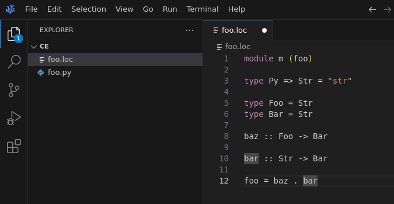

# morloc VS Code extension

This extension provides syntax highlighting and snippet support for the
`[morloc](https://github.com/morloc-project/morloc)` programming language.

## Preview

## License

[MIT](./LICENSE)
